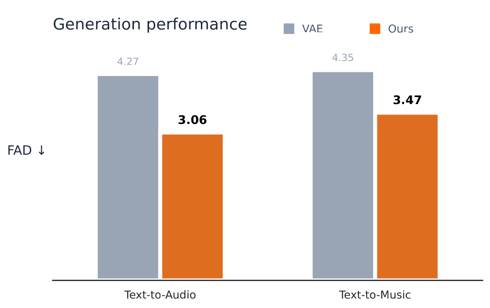
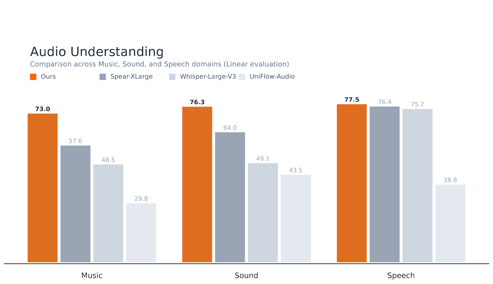

# DashengTokenizer

<div align="center">


<a href="https://arxiv.org/abs/2602.23765"></a>
 <a href="https://huggingface.co/mispeech/dashengtokenizer"></a>
 <a href="https://arxiv.org/abs/2602.2602.23765"></a>
<a href="https://huggingface.co/mispeech/dashengtokenizer/colab">
  
</a>

</div>

DashengTokenizer is a high-performance continious audio tokenizer designed for audio understanding and generation tasks. Compared to previous works, our framework trains a **single linear layer** to enable audio generation for semantically strong encoders, **without** a Variational AutoEncoder (VAE).

Achievements:

* **State-of-the-Art** Audio Understanding: DashengTokenizer consistently outperforms most previous self-supervised and supervised audio encoders.
* **High-Fidelity** Signal Reconstruction: Maintains exceptional signal integrity, ensuring that audio remains crisp and accurate after processing.
* Accelerated **Audio Generation** Training: Achieves optimal performance significantly faster than standard VAE models, reducing training time and costs.
* Superior **Speech Enhancement**: Provides a more robust encoding foundation for isolating and clarifying speech in noisy environments.


<p align="center">
  
  
</p>

# 🚀 Quick Start
Installation
Ensure you have the necessary dependencies installed:

```
uv pip install transformers torch torchaudio einops
```

Python

```python
import torch
import torchaudio
from transformers import AutoModel

# 1. Load the model from Hugging Face
model = AutoModel.from_pretrained("mispeech/dashengtokenizer", trust_remote_code=True)
model.eval()

# 2. Load your audio file (ensure it is 16kHz)
# If your audio is a different rate, resample it using torchaudio.transforms.Resample
audio, sr = torchaudio.load("path/to/your/audio.wav")

if sr != 16000:
    resampler = torchaudio.transforms.Resample(sr, 16000)
    audio = resampler(audio)

# 3. Generate Embeddings/Tokens
with torch.no_grad(), torch.autocast(device_type='cuda'):
    # The model expects a batch dimension [batch, samples]
    if audio.ndim == 1:
        audio = audio.unsqueeze(0)
    
    embeddings = model.encode(audio)
    print(f"Embedding shape: {embeddings.shape}")

# 4. (Optional) Reconstruct/Decode
reconstructed_audio = model.decode(embeddings)
```


## Use Cases

### 1. Audio Encoding
```python
embeddings = model.encode(audio)
reconstructed = model.decode(embeddings)
```

### 2. Feature Extraction
```python
# Extract rich audio features for downstream tasks
features = model.encode(audio)
# Use features for classification, clustering, etc.
```


## Citation

If you use DashengTokenizer in your research, please cite:

```bibtex
@article{dinkel2026dashengtokenizer,
  title={DashengTokenizer: One layer is enough for unified audio understanding and generation},
  author={Dinkel, Heinrich and Sun, Xingwei and Li, Gang and Mei, Jiahao and Niu, Yadong and Liu, Jizhong and Li, Xiyang and Liao, Yifan and Zhou, Jiahao and Zhang, Junbo and others},
  journal={arXiv preprint arXiv:2602.23765},
  year={2026}
}
```
